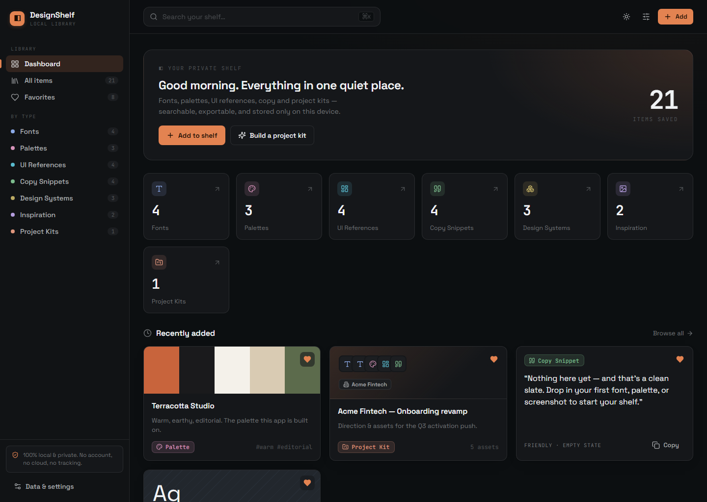
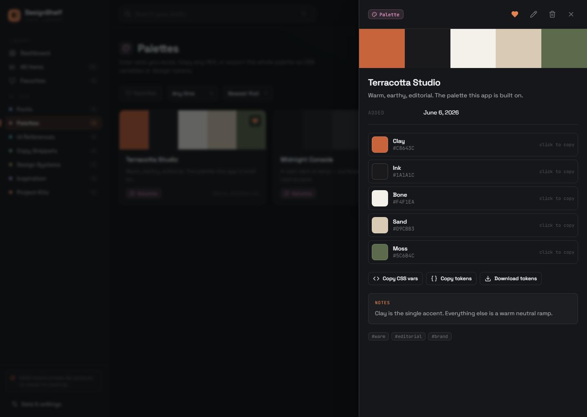

# DesignShelf

[](https://github.com/peals-pline/design-shelf/actions/workflows/ci.yml)
[](https://github.com/peals-pline/design-shelf/releases)
[](LICENSE)

**A private, local-first design library for UX/UI designers.**

DesignShelf helps designers collect fonts, color palettes, UI references, copy
snippets, design systems, inspiration, and project kits in one searchable
workspace. No account is required, and the current MVP stores everything in
your browser.

[Open the live demo](https://peals-pline.github.io/design-shelf/)



> **Project status:** usable MVP, actively being improved. The current release
> is intentionally lightweight and runs as a static browser application. The
> hosted demo uses the same local-only browser storage as a local installation.

## Why DesignShelf?

Design resources tend to end up everywhere: fonts in folders, palettes in
Figma, references in bookmarks, screenshots in Downloads, and copy snippets in
notes. DesignShelf turns that scattered material into a focused working
library.

## Features

- Dashboard with item counts, recent additions, and favorites
- Fonts, palettes, UI references, copy snippets, design systems, and inspiration
- Search, tags, type filters, favorites, and sorting
- Project kits that combine reusable assets for a specific design direction
- Project kit export as a Markdown design brief
- Palette export as CSS variables or design tokens JSON
- Full JSON backup and import
- Dark and light themes with interface density and accent controls
- Demo data for exploring the product immediately
- Local browser storage with no login, analytics, or remote backend

## Local-first and private

DesignShelf does not send library data to a third-party server. In the current
MVP, data is stored in `localStorage` for the browser and origin where the app
is opened.

Export a JSON backup regularly if the library contains important work. Clearing
browser data can remove locally stored items.

## Run locally

The MVP has no build step. Serve the repository with any static HTTP server:

```bash
python -m http.server 4173
```

Then open [http://localhost:4173](http://localhost:4173).

Opening `index.html` directly may work in some browsers, but a local HTTP server
is recommended.

## Current architecture

- React 18
- Browser-side JSX via Babel Standalone
- Plain CSS design system
- Lucide icons
- `localStorage` persistence
- Static HTML delivery

The long-term architecture may move to Vite, TypeScript, and IndexedDB, but the
repository documents the implementation that exists today rather than claiming
unfinished infrastructure.

## Screens

### Designer-focused dashboard


### Palette details and exports



## Roadmap

Near-term work focuses on hardening the existing MVP without replacing its
visual language:

- Improve narrow-screen layout and navigation
- Associate form labels and fields and strengthen keyboard focus behavior
- Expand automated coverage for search, filters, validation, and exports
- Add automated tests for search, filters, validation, and export generators
- Introduce an IndexedDB storage adapter with a safe migration path
- Move the runtime to Vite and TypeScript after behavior is covered by tests

See [ROADMAP.md](ROADMAP.md) for release milestones.

## Font and asset licenses

DesignShelf does not redistribute fonts or third-party design assets. Users are
responsible for checking and respecting the licenses of every font, image, and
resource they add to their local library.

## Contributing

Issues and focused pull requests are welcome. Please read
[CONTRIBUTING.md](CONTRIBUTING.md) before proposing a larger change.

## Maintainer workflow

DesignShelf is maintained through public [issues](https://github.com/peals-pline/design-shelf/issues), focused pull requests, CI checks, and versioned [releases](https://github.com/peals-pline/design-shelf/releases). Near-term decisions and migration work remain visible in [ROADMAP.md](ROADMAP.md) and [CHANGELOG.md](CHANGELOG.md).

## Security

Please report security or privacy concerns according to
[SECURITY.md](SECURITY.md).

## License

[MIT](LICENSE) © 2026 Denis Dyakov
